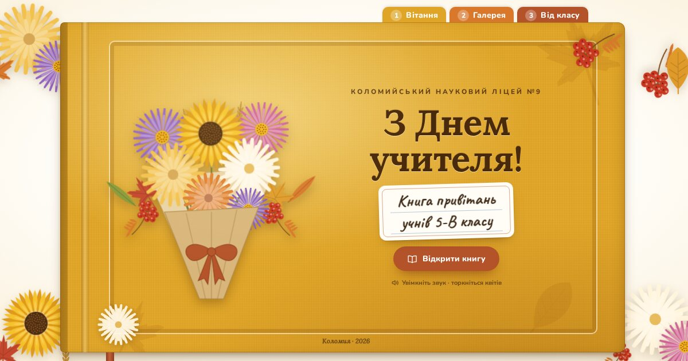

# З Днем учителя! — книга привітань 5-В класу

Інтерактивна «книга» з привітаннями з Днем учителя від учнів 5-В класу
Коломийського наукового ліцею №9. Осінній мінімалізм: жовтуваті кольори на білому
тлі, зошит у клітинку й лінійку, закладки-стікери, малярний скотч, засушене листя.



## Як це працює

1. **Обкладинка.** Натискаєте «Відкрити книгу», і сторінка перегортається.
   Без натискання браузери не дозволяють вмикати звук.
2. **Сторінка 1:** відео `videos/1.mp4`, у якому учні вітають учителів.
3. Після відео йде пауза з відліком 4 секунди (стікер «Далі — галерея наших учителів»),
   потім книга сама перегортається далі.
4. **Сторінка 2:** галерея вчителів. Портрети в рамах із підсвіткою безупинно пропливають
   стіною музею. Вчителі одного предмета (польська, українська, англійська, інформатика,
   трудове навчання) стоять поруч в одній ніші зі спільною табличкою. На фоні грає
   `music/Вчителі.mp3`, трохи пришвидшена, і галерея проходить рівно за час пісні.
   Олівець унизу показує, скільки ще лишилося.
   - **«Розклад»** з іконок над галереєю підсвічує поточний предмет. Якщо натиснути іконку,
     галерея перейде до цього вчителя.
   - **Іконки на табличках оживають**: штурвал крутиться, серце б'ється, прапор майорить,
     з'являється підпис і розлітаються листочки. Коли вчитель проїжджає центр, це
     відбувається само.
   - Якщо натиснути на портрет, він збільшиться, а галерея стане на паузу (`Esc` закриває).
5. **Сторінка 3:** відео `videos/2.mp4` — вітання від усього класу.
6. Наприкінці відкривається сторінка подяки. На ній є іконки всіх предметів: натисніть, щоб
   сказати «дякую» кожному. Натиснута оцінка «12» ставиться, як штамп. Унизу кнопка
   «Переглянути ще раз».

Гортати можна й вручну: закладки зверху, стрілки під книгою, загнутий куточок сторінки,
свайп на телефоні.

| Клавіша | Дія |
| --- | --- |
| `→` / `←` | наступна / попередня сторінка |
| `Пробіл` | пауза / продовжити (відео або галерея) |
| `F` | на весь екран (зручно для проєктора) |
| `M` | вимкнути / увімкнути музику галереї |
| `Home` / `End` | обкладинка / остання сторінка |

## Публікація на GitHub Pages

1. Злийте цю гілку в `main`.
2. Відкрийте в репозиторії **Settings → Pages**.
3. У розділі **Build and deployment** оберіть **Source: Deploy from a branch**,
   гілку `main` і папку `/ (root)`, потім натисніть **Save**.
4. За хвилину-дві сайт з'явиться за адресою
   `https://valentiteach.github.io/Teacher-sDayGreetings/`.

Якщо адреса інша, змініть посилання в `<meta property="og:image">` у `index.html`.
Саме ця картинка показується у прев'ю, коли посиланням діляться у Viber чи Telegram.

Перевірити сайт на своєму комп'ютері можна так: `npx http-server .` у папці проєкту,
потім відкрити `http://localhost:8080`.

## Як змінити

Усе редагується на початку файлу `js/app.js`.

- **Вчителі:** масив `EXHIBITS`. Кожен запис описує один предмет з 1–2 фото, і порядок
  записів збігається з порядком у галереї. Щоб підписати вчителів, додайте `names`:
  ```js
  { subject: 'Інформатика', icons: ['i-laptop', 'i-code'],
    photos: ['photo/16.jpg', 'photo/17.jpg'], names: ['Ім’я По батькові', 'Ім’я По батькові'] },
  ```
  Підписи й анімації іконок задано в `ICON_TIPS`.
  Доступні іконки (`<symbol id="i-…">` в `index.html`): `i-helm`, `i-school`, `i-class`,
  `i-history`, `i-care`, `i-together`, `i-sprout`, `i-magnifier`, `i-math`, `i-compass`,
  `i-say-pl`, `i-flag-pl`, `i-ball`, `i-stopwatch`, `i-say-ua`, `i-flag-ua`, `i-say-en`,
  `i-flag-gb`, `i-palette`, `i-brush`, `i-book`, `i-quill`, `i-note`, `i-piano`,
  `i-laptop`, `i-code`, `i-candle`, `i-bible`, `i-smile`, `i-heart`, `i-hammer`, `i-gear`.
- **Паузи між частинами:** об'єкт `CONFIG`. Там задано `pauseAfterVideo1` (пауза перед
  галереєю), `pauseAfterGallery` і `pauseAfterVideo2`, усе в секундах.
- **Швидкість галереї та пісні:** `musicRate` у `CONFIG` (`1` — звичайна швидкість,
  `1.1` — на 10 % швидше). `musicEnd` — секунда, де в пісні закінчується звук: у кінці
  файлу, з 2:47,5 до 3:01, лише тиша, тому галерея завершується разом зі звуком.
- **Відео:** замініть `videos/1.mp4` або `videos/2.mp4` файлом з тією самою назвою.
  Рамка сама підлаштується під пропорції, вертикальне відео теж підійде. Картинки-заставки
  до відео лежать в `assets/poster-1.jpg` та `assets/poster-2.jpg`, їх варто оновити
  або видалити атрибут `poster` у `index.html`.
- **Музика:** `music/Вчителі.mp3`. Галерея сама підлаштує швидкість під тривалість пісні.
  Якщо заміните пісню, оновіть `musicEnd`.
- **Тексти** сторінок, обкладинки й подяки лежать прямо в `index.html`.

## Структура

```
index.html          сторінки книги та SVG-іконки
css/style.css       оформлення, перегортання, адаптивність
css/fonts.css       підключення шрифтів
js/app.js           логіка: сценарій, галерея, музика, керування
fonts/              Caveat, Lora, Nunito (SIL Open Font License, див. fonts/OFL.txt)
assets/             заставки відео, іконка сайту, картинка для прев'ю
photo/  videos/  music/
```

Сайт не потребує збирання чи сторонніх бібліотек. Шрифти лежать у репозиторії,
тож усе працює навіть без доступу до Google Fonts. Сайт розрахований на сучасні браузери:
Chrome, Edge, Safari 16+ (iPhone, iPad, Mac) і Firefox.
